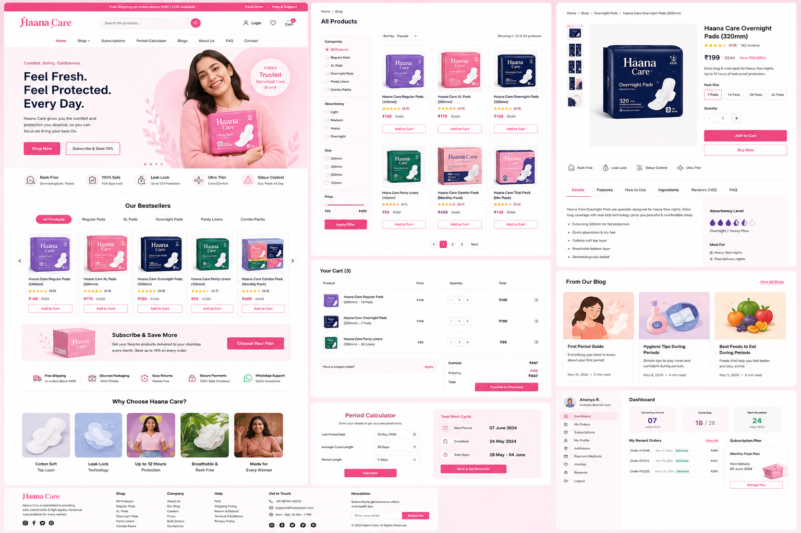

# Haana Care | Premium Organic Menstrual Care

An ultra-premium, interactive e-commerce web application for **Haana Care**, built using **React**, **Tailwind CSS (v4)**, and **React Router**. This project has been built in high visual fidelity to match the design mockup specifications.

---

## 🎨 Design Mockup Reference

Below is the visual mockup that this application implements:



---

## 🚀 Key Features

1. **Vibrant & Premium Aesthetics**: tailwinds HSL tailored color palette, Plus Jakarta & Outfit typography imports, subtle micro-animations, and custom glassmorphism utilities.
2. **Global E-Commerce Routing**: Native routes handled via React Router including:
   - **Shop catalog list** with price limiters, category filters, and ratings selectors.
   - **Product details page** with droplets absorbency display meters, pack size selector tabs, and photo thumbnails swap switcher.
   - **Interactive shopping cart** with coupon codes support (`HAANA15` for 15% discount, `FREESHIP` for free shipping).
   - **Checkout form summary** and order placement completion.
3. **Period calculator**: Form calculator calculating ovulation and fertile cycles dates based on last start inputs, synced dynamically to the Dashboard.
4. **Health blogs catalog**: Educational guides catalog with reading overlays popups.
5. **Customer Dashboard**: Overview of recent order histories, cycle day progress circles, and subscription plan status indicators.
6. **Side-by-side comparison**: Interactive floating button at the bottom-left of the site that toggles the design mockup modal on top for quick comparison.

---

## 🛠️ Project Setup

Follow these steps to run the application locally:

### 1. Install Dependencies
Run the command below in the project directory to install all packages:
```bash
npm install
```

### 2. Run the Development Server
Launch the local server:
```bash
npm run dev
```
Open **http://localhost:5173/** in your web browser.

### 3. Build for Production
Verify compilations and build a production bundle:
```bash
npm run build
```
Production assets will compile inside the `dist/` directory.

---

## 📁 Component Directory structure

- `src/context/CartContext.jsx` - Core context provider for shopping states and cycle dates.
- `src/components/Header.jsx` - Navigation bar with promotional banners.
- `src/components/Footer.jsx` - Standard website footer.
- `src/components/Hero.jsx` - Landing banner with highlights badges.
- `src/components/ProductCard.jsx` - Shopping card.
- `src/components/FilterSidebar.jsx` - Refiners list.
- `src/components/CartItem.jsx` - Item rows.
- `src/pages/` - E-commerce pages routes directories.
- `src/data/products.js` - Mock datasets for products, blogs, and FAQ listings.
"# Hana-care" 
